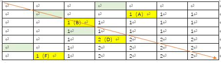

# Hackerrank
Here are some great questions from the Hackerrank

## Highest Value Palindrome
My question is when chars[i] != chars[j], and then changeBoth - 1 >= 0. But when chars[i] == chars[j], and then changeBoth - 2 >= 0?

## Sherlock and Anagrams
This question can be divided into two steps.
### Step 1
Traverse the entire string, increasing and dividing in steps according to the step size of the substring like 1, 2, 3, ... string.length().
### Step 2
write a method to calculate whether two strings belong to Anagram.
both char array and HashMap can be used.

Refer to https://github.com/EunHyeJung/AlgorithmStudy/blob/master/Hackerrank/Sherlock-and-Anagrams.java

## Common Child
The main purpose of the question is to find out the largest subsequence from the two given strings.
### The core idea

The above image shows the core idea of the method. The Table is the length of "ABCDEF" (6) * the length of "FBDAMN" (6). 

The example shows the process of calculating the "ABCDEF" and "FBDAMN".
### Step 1
Set the initial value of the line[0][j] and line[i][0].
### Step 2
if line[i-1][j] == line[i][j-1], then line[i][j]+=1.
### Step 3
else line[i][j] = Max(line[i-1][j],line[i][j-1]).

Refer to https://github.com/shivam04/hackerrank/blob/master/common-child.java
